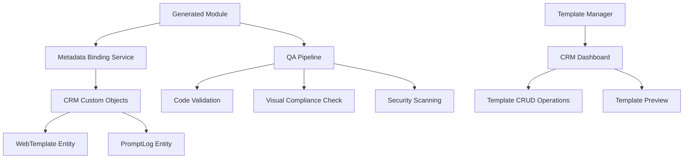

# Sprint 4 Kickoff: Metadata Binding & QA Pipeline
## Advanced CRM Integration & Quality Assurance System

**Sprint Duration:** Sprint 4 (2 weeks)  
**Start Date:** January 26, 2025  
**Target Completion:** February 9, 2025  
**Status:** 🚀 ACTIVE

---

## 🎯 Sprint 4 Objectives

Sprint 4 focuses on creating robust metadata binding between generated modules and CRM entities, implementing a comprehensive QA pipeline for generated code, and establishing visual compliance testing to ensure design system consistency.

### Primary Goals:

1. **CRM Metadata Integration** - Connect generated modules to Twenty CRM data objects
2. **QA Pipeline Implementation** - Automated validation and testing of generated code
3. **Visual Compliance System** - Ensure design token adherence and UI consistency
4. **Template Management** - CRM-native template storage and lifecycle management

---

## 🏗️ Sprint 4 Architecture

### System Components to Build:



---

## 📋 Sprint 4 Deliverables

### 1. CRM Metadata Binding System

**File:** `integration/plugins/metadata-binding/crm-connector.ts`

**Features to Implement:**
- ✅ WebTemplate custom object integration with Twenty CRM
- ✅ PromptLog tracking and audit trail
- ✅ Generated module to CRM entity linking
- ✅ Template metadata persistence
- ✅ CRM workflow integration hooks

**Key Capabilities:**
```typescript
interface WebTemplate {
  id: string;
  name: string;
  slug: string;
  template_type: 'component' | 'page' | 'widget' | 'form';
  schema: ModuleSchema;
  render_page: string;
  linked_crm_record?: string;
  created_at: Date;
  updated_at: Date;
  status: 'active' | 'draft' | 'archived';
}

interface PromptLog {
  id: string;
  prompt: string;
  generated_files: GeneratedFile[];
  timestamp: Date;
  status: 'success' | 'failure' | 'partial';
  feature_type: string;
  user_id: string;
  template_id?: string;
}
```

### 2. QA Pipeline System

**File:** `integration/plugins/qa-pipeline/validation-engine.ts`

**Features to Implement:**
- ✅ Automated code linting and syntax validation
- ✅ TypeScript type checking for generated modules
- ✅ Security vulnerability scanning
- ✅ Performance analysis and optimization suggestions
- ✅ Dependency validation and conflict detection
- ✅ Generated code quality scoring

**Validation Stages:**
```typescript
interface QAValidationResult {
  stage: 'syntax' | 'types' | 'security' | 'performance' | 'dependencies';
  status: 'pass' | 'warning' | 'error';
  issues: ValidationIssue[];
  score: number; // 0-100
  suggestions: string[];
}

interface ValidationPipeline {
  runSyntaxValidation(code: string): Promise<QAValidationResult>;
  runTypeChecking(files: GeneratedFile[]): Promise<QAValidationResult>;
  runSecurityScan(code: string): Promise<QAValidationResult>;
  runPerformanceAnalysis(component: string): Promise<QAValidationResult>;
  runDependencyCheck(dependencies: string[]): Promise<QAValidationResult>;
}
```

### 3. Visual Compliance Testing

**File:** `integration/plugins/visual-compliance/design-validator.ts`

**Features to Implement:**
- ✅ Design token usage validation
- ✅ Component style consistency checking
- ✅ Accessibility compliance testing
- ✅ Responsive design validation
- ✅ Brand guideline adherence
- ✅ Visual regression testing setup

**Compliance Checks:**
```typescript
interface VisualComplianceCheck {
  checkDesignTokenUsage(component: string): ComplianceResult;
  validateAccessibility(html: string): AccessibilityResult;
  checkResponsiveDesign(css: string): ResponsiveResult;
  validateBrandGuidelines(styles: CSSProperties): BrandResult;
  runVisualRegression(component: string): RegressionResult;
}

interface ComplianceResult {
  compliant: boolean;
  violations: ComplianceViolation[];
  score: number;
  recommendations: string[];
}
```

### 4. Template Management Dashboard

**File:** `integration/plugins/template-manager/template-dashboard.tsx`

**Features to Implement:**
- ✅ CRM-native template listing and search
- ✅ Template preview and editing interface
- ✅ Template lifecycle management (draft → active → archived)
- ✅ Template sharing and collaboration
- ✅ Usage analytics and performance metrics
- ✅ Template versioning and rollback

**Dashboard Components:**
```tsx
interface TemplateDashboard {
  TemplateList: React.FC<{ filters: TemplateFilters }>;
  TemplatePreview: React.FC<{ templateId: string }>;
  TemplateEditor: React.FC<{ template: WebTemplate }>;
  TemplateAnalytics: React.FC<{ templateId: string }>;
  TemplateVersionHistory: React.FC<{ templateId: string }>;
}
```

---

## 🔧 Technical Implementation Plan

### Phase 1: CRM Integration Foundation (Days 1-3)

1. **Custom Object Schema Definition**
   - Define WebTemplate and PromptLog entities in Twenty CRM
   - Create database migrations and GraphQL schemas
   - Implement CRUD operations and API endpoints

2. **Metadata Binding Service**
   - Build service to link generated modules to CRM data
   - Implement template persistence and retrieval
   - Create hooks for CRM workflow integration

### Phase 2: QA Pipeline Development (Days 4-7)

1. **Code Validation Engine**
   - Implement syntax and type checking
   - Build security scanning capabilities
   - Create performance analysis tools

2. **Validation Orchestration**
   - Design pipeline workflow and staging
   - Implement parallel validation processing
   - Create validation result aggregation

### Phase 3: Visual Compliance System (Days 8-10)

1. **Design Token Validation**
   - Build token usage checker
   - Implement style consistency validation
   - Create accessibility compliance testing

2. **Visual Testing Framework**
   - Set up visual regression testing
   - Implement responsive design validation
   - Create brand guideline checking

### Phase 4: Template Management (Days 11-14)

1. **CRM Dashboard Integration**
   - Build template management UI within Twenty CRM
   - Implement template preview and editing
   - Create template analytics and metrics

2. **Template Lifecycle Management**
   - Implement versioning and rollback
   - Build template sharing and collaboration
   - Create usage tracking and optimization

---

## 🧪 Testing Strategy

### Comprehensive Test Coverage:

1. **Unit Tests**
   - Metadata binding service functions
   - QA validation engine components
   - Visual compliance checkers
   - Template management operations

2. **Integration Tests**
   - CRM custom object integration
   - End-to-end QA pipeline execution
   - Template lifecycle workflows
   - Cross-system data consistency

3. **End-to-End Tests**
   - Complete module generation → QA → CRM integration flow
   - Template management user workflows
   - Visual compliance validation scenarios
   - Performance and scalability testing

### Test Scenarios:

```typescript
interface Sprint4TestSuite {
  // Metadata binding tests
  testWebTemplateCreation(): Promise<TestResult>;
  testPromptLogPersistence(): Promise<TestResult>;
  testCRMEntityLinking(): Promise<TestResult>;
  
  // QA pipeline tests
  testCodeValidationPipeline(): Promise<TestResult>;
  testSecurityScanning(): Promise<TestResult>;
  testPerformanceAnalysis(): Promise<TestResult>;
  
  // Visual compliance tests
  testDesignTokenValidation(): Promise<TestResult>;
  testAccessibilityCompliance(): Promise<TestResult>;
  testVisualRegression(): Promise<TestResult>;
  
  // Template management tests
  testTemplateDashboard(): Promise<TestResult>;
  testTemplateVersioning(): Promise<TestResult>;
  testTemplateSharing(): Promise<TestResult>;
}
```

---

## 📊 Success Metrics

### Quality Metrics:
- **Code Quality Score:** >85% for all generated modules
- **Security Compliance:** 100% vulnerability-free generated code
- **Visual Compliance:** >95% design token adherence
- **Performance:** <2s template loading time in CRM dashboard

### Integration Metrics:
- **CRM Integration:** 100% metadata persistence success rate
- **Template Management:** <500ms CRUD operation response time
- **QA Pipeline:** <30s complete validation cycle
- **User Experience:** <3 clicks to access any template function

### System Reliability:
- **Uptime:** 99.9% QA pipeline availability
- **Error Rate:** <1% validation false positives
- **Data Consistency:** 100% CRM-template data synchronization
- **Scalability:** Support 1000+ concurrent template operations

---

## 🔄 Integration Points

### With Existing Sprint 3 Systems:

1. **Enhanced Gemini Client**
   - Integrate QA validation into generation pipeline
   - Add metadata binding to module creation workflow
   - Implement template-aware generation context

2. **Module Creator System**
   - Add CRM metadata creation to file generation
   - Integrate QA pipeline into module creation
   - Implement template versioning support

3. **Hot-Reload System**
   - Add template status monitoring
   - Integrate visual compliance checking
   - Implement template change propagation

4. **Sprint 3 Integration Service**
   - Extend with metadata binding capabilities
   - Add QA pipeline orchestration
   - Implement template management workflows

---

## 🎯 Sprint 4 Key Features

### 🆕 New Capabilities:

1. **CRM-Native Template Management**
   - Templates stored as first-class CRM entities
   - Full CRUD operations within CRM interface
   - Template sharing and collaboration features

2. **Automated Quality Assurance**
   - Multi-stage validation pipeline
   - Security and performance scanning
   - Quality scoring and recommendations

3. **Visual Compliance Enforcement**
   - Design token usage validation
   - Accessibility compliance checking
   - Brand guideline adherence

4. **Advanced Template Analytics**
   - Usage tracking and performance metrics
   - Template optimization suggestions
   - User behavior analytics

### 🔧 Technical Enhancements:

1. **Robust Error Handling**
   - Comprehensive validation error reporting
   - Graceful degradation for partial failures
   - Automated recovery mechanisms

2. **Performance Optimization**
   - Parallel validation processing
   - Caching for repeated validations
   - Optimized database queries

3. **Security Hardening**
   - Input sanitization and validation
   - Code injection prevention
   - Secure template storage

---

## 🚀 Sprint 4 Deliverable Timeline

### Week 1 (Days 1-7):
- **Day 1-2:** CRM custom object schema and API setup
- **Day 3-4:** Metadata binding service implementation
- **Day 5-6:** QA pipeline foundation and code validation
- **Day 7:** Integration testing and validation

### Week 2 (Days 8-14):
- **Day 8-9:** Visual compliance system implementation
- **Day 10-11:** Template management dashboard development
- **Day 12-13:** End-to-end integration and testing
- **Day 14:** Documentation, deployment, and sprint completion

---

## 🔮 Future Sprint Preparation

### Sprint 5 Readiness:
- **Template System Foundation** - Ready for advanced template features
- **QA Pipeline** - Extensible for additional validation types
- **CRM Integration** - Foundation for workflow automation
- **Visual Compliance** - Ready for advanced design system features

### Technical Debt Management:
- **Performance Monitoring** - Detailed metrics collection setup
- **Error Logging** - Comprehensive logging and alerting
- **Documentation** - API documentation and user guides
- **Security Auditing** - Regular security review processes

---

## 🏁 Sprint 4 Success Definition

Sprint 4 will be considered successful when:

1. **Generated modules are automatically stored as CRM entities** with full metadata
2. **QA pipeline validates all generated code** with comprehensive reporting
3. **Visual compliance is enforced** with design token validation
4. **Template management is fully integrated** into CRM dashboard
5. **All systems work together seamlessly** with <5s end-to-end processing
6. **Comprehensive test coverage** ensures system reliability

The foundation will be complete for rapid, high-quality CRM feature development with enterprise-grade quality assurance and CRM-native template management.

---

*Sprint 4 initiated on January 26, 2025*  
*Target completion: February 9, 2025*  
*Next: Sprint 5 - Final QA & Deployment*
